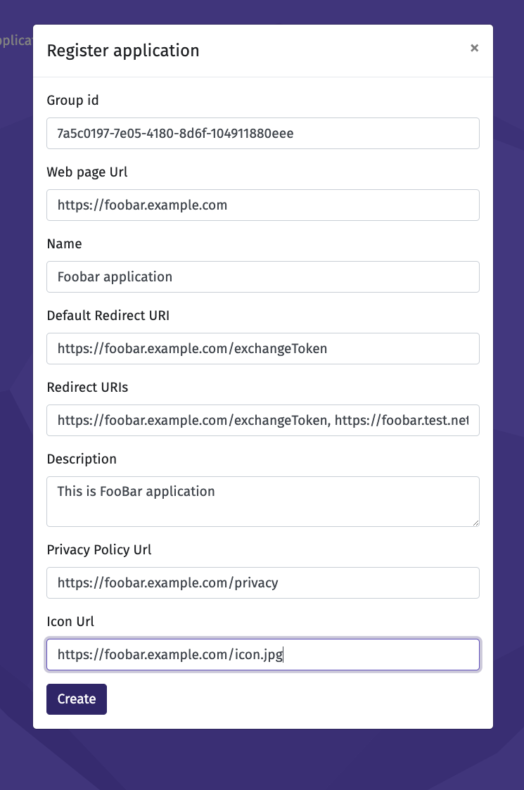
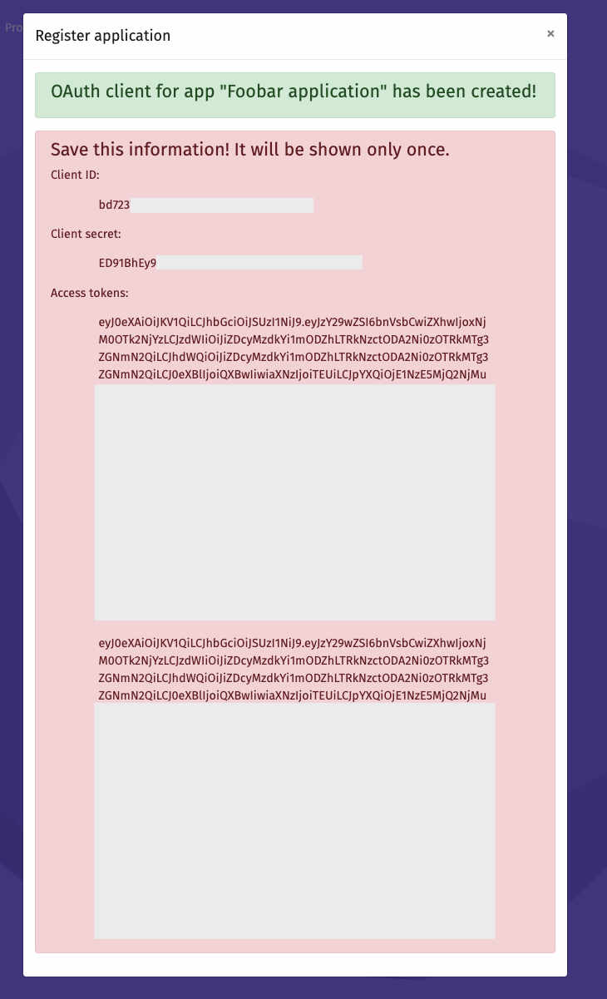

## Introduction 

## Overview

1. What is application? 
2. Create a group
3. How to register an application.
   1. Parameters 
   2. Application API 
   3. Web 
4. Summary


## What is application?

Application is simply an identity in Platform of Trust. You can read more about identities in our [Identities and links](./guides/identities-and-links) guide. However `application` has a special purpose for developers. It is required to start building your own applications on top of Platform of Trust. 

After registering an application, you will be able to do these most common and useful things in the platform:

1) Explore and consume data products
2) Implement authorization flow for your users 

This guide is meant for developers who has already created an account in Platform of Trust and are familiar with basic concepts such as `Authorization token` and `Identities`. 

## Create a group

Before you can create an application, you should make sure you are a part of a `Group`. It can be either an organization you are working for, or just a group of developers you are developing with. `Group` must be an identity in Platform of Trust, and you must be linked to it with `MemberOf` type of `Link`.

If you don't belong to any `Group`, you must use [world-sandbox.oftrust.net](https://world-sandbox.oftrust.net) to create a `Group`. In UI you can create an `Identity` with a `Group` type, you will get its ID which you will provide when create an application. Upon creation a UI will show: 
```
Group "FooBar" was created. Use this id to create application: 7a5c0197-7e05-4180-8d6f-104911880eee
```
 
 This means that now you belong to `FooBar` group. 

## How to register an application

You can either use `Application API` or [world-sandbox.oftrust.net](https://world-sandbox.oftrust.net). But let's see first what parameters you need to specify.

### Parameters:

Remember that your application will be just like any other `Identity`. So you might want to provide a description and other information. Some of that information will be shown to users during `Authorization` flow or later when exploring their network of `Identities` .

`name` - Name of your application. <br/> 
`description` - Short description. <br/> 
`privacyPolicyUrl` - Where users can be referred to. <br/> 
`webPageUrl` - Web page of your app. <br/> 
`iconUrl` - Icon of your application. <br/>
`scopes` - Required, can be empty "". <br/> 
`defaultScopes` - Required, can be empty "". <br/> 
`redirectUris` - comma-separated list of redirect uris, usually for `exchangeToken` api. <br/> 
`defaultRedirectUri` - This redirect uri is used if other is not provided<br/>  
`groupId` - Group ID user belong to and create an application. 


As you can see some of parameters such as `scopes`, `redirectUris` and so on will later be used for `Authorization flow`. You can read more in "Integrate OAuth 2.0 to access Platform of Trust APIs" guide.

### Application API

In order to create an application, you can send a request to `Application API`:

```
curl --request POST \
  --url https://api-sandbox.oftrust.net/apps/v1 \
  --header 'authorization: <INSERT_AUTHORIZATION_TOKEN>' \
  --header 'content-type: application/json' \
  --data '{
  "name": "Example Application",
  "description": "Application description",
  "privacyPolicyUrl": "http://example.com/privacy.html",
  "webPageUrl": "http://example.com/application.html",
  "iconUrl": "http://example.com/icon.png",
  "scopes": "",
  "defaultScopes": "",
  "redirectUris": "https://example.com/auth-callback",
  "defaultRedirectUri": "https://example.com/auth-callback",
  "groupId": "7a5c0197-7e05-4180-8d6f-104911880eee"
}'
``` 
 
In case of successful request, you should get similar data in the response:

NOTE: The `clientSecrets` is shown only once in plain text, when creating
the application. Make sure you save it somewhere. The client secret is
used for validating the application.

```
{
  "@context": "https://standards.lifeengine.io/v1/Context/Identity/Digital/Software/App/",
  "@type": "App",
  "@id": "0509f3e9-55bc-4649-84d5-3ef2d3b807e9",
  "inLinks": [],
  "outLinks": [],
  "data": {
    "name": "Example Application",
    "webPageUrl": "http://example.com/application.html",
    "iconUrl": "http://example.com/icon.png",
    "description": "Application description",
    "privacyPolicyUrl": "http://example.com/privacy.html"
  },
  "metadata": {
    "createdAt": "2019-10-24T13:49:35+00:00",
    "createdBy": "e153e200-14d5-43ce-95dc-2db22ac6767f",
    "updatedAt": "2019-10-24T13:49:35+00:00",
    "updatedBy": "e153e200-14d5-43ce-95dc-2db22ac6767f"
  },
  "client": {
    "clientId": "0309f3e2-84d5-55bc-4649-3ef2x3b607e9",
    "redirectUris": "https://example.com/auth-callback",
    "defaultRedirectUri": "https://example.com/auth-callback",
    "scopes": "",
    "defaultScopes": "",
    "clientSecrets": [
      "1DFuZdfrp5HR00lkQVUpdr4CcrckRaybKhnNTZSiEHx"
    ]
  },
  "tokens": [
    {
      "access_token": "Yv786SFVjS2I3W8ql2uNMWXEidWJ9_ratFapk5wDyM5BQMAGZlTA5ZjNlOS01NWJjLTQ2NDktODRkNS0zZWYyZDNiODA3ZTkiLCJhdWQiOiIwNTA5ZjNlOS01NWJjLTQ2NDktODRkNS0zZWYyZDNiODA3ZTkiLCJ0eXBlIjoiQXBwIiwiaXNzIjoiTEUiLCJpYXQiOjE1NzE5MjQ5NzUuMCwic2NvcGVzIjoiIn0.-ENrEVP08UqbnJZgxYgBp53RpxT-HMLqGc85sGcolyUqeqqNpIbNmD3l6LxxIdDqfzeyJ0eXAiOiJKV1QiLCJhbGciOiJSUzI1NiJ9.eyJzY29wZSI6bnVsbCwiZXhwIjoxNjM0OTk2OTc1LCJzdWIiOiIwNqwZnp0h9r1XPngbbWwxXTBDGhWsjzMVwCc1GE_eJ0V6yYZjkteW8fTUQM_kRdpK6w__gx2u1MfIgT8HU6B-_vR9oSJD77SrdBpF48z3fsrW1fc65uPCmYBk2JH0ChIqfFSCpt-1Ptmrv4icqK_jVtKqYKlrRmcg2lX1-LxADgZjqxl0yRtjVW94WQRjMbmRr8t60enpRB8g7Rr7q2TJbiD_J7tYSyAqYqFXZNMD9KTpmhQtHcwj3MZ9TzJFF2pvq5z5H7v_paU1JRU-oAEEvJTW-hzhNW3owEe_Uzy3o8AbURVuC_xvQhWEDiHruIAH4g1F0ec4Qq2glJUYd_oR6NFebB_AWGHBHeLCGGS5DyP6Td5nrJkyUrWyKWk6QK86GJTHw2B9iZc0hPuY8LUr0GhvF1VGBejJdVwx8EtH84Y-2eSaokMI9e0QtrnrBbCMRZLAMGXDcdN985WYZPI_7tnBDNcJYkRLgwjPeH1nPaMImtUtnNY3ka0G21Jz6CqdSp8Uqubvdgqsm6mySg2JYk0-Zbb7ZdpllPiLH2sPsVVkUUXtBnGT5QsA",
      "expires_in": 63072000,
      "token_type": "Bearer"
    },
    {
      "access_token": "URVuC_xvQhWEDiHruIAH4g1F0ec4Qq2glJUYd_oR6NFebB_AWGHBHeLCGGS5DyP6Td5nrJe.eyJzY29wZSI6bnVsbCwiZXhwIjoxNjM0OTk2OTc1LCJzdWIiOiIwNTA5ZjNlOS01NWJjLTQ2NDktODRkNS0zZWYyZDNiODA3ZTkiLCJhdWQiOiIwNTA5ZjNlOS01NWJjLTQ2NDktODRkNS0zZWYyZDNiODA3ZTkiLCJ0eXBlIjoiQXBwIiwiaXNzIjoiTEUiLCJpYXQiOjE1NzE5MjQ5NzUuMCwic2NvcGVzIjoiIn0.Yv786SF-ENrEVP08UqbnJZgxYgBp53RpxT-HMLqGc85sGcolyUqeqqNpIbNmD3l6LxxIdDqfzqwZnp0h9r1XPngbbWwxXTBDGhWsjzMVwCc1GE_eJ0V6yYZjkteW8fTUQM_kRdpK6w__gx2u1MfIgT8HU6B-_vR9oSJD7npRB8g7Rr7q2TJbVjS2I3W8ql2yJ0eXAiOiJKV1QiLCJhbGciOiJSUzI1NiJ9uNMWXEidWJ9_ratFapk5wDyM5BQMAGZliD_J7tYSyAqYqF7SrdBpF48z3fsrW1fc65uPCmYBk2JH0ChIqfFSCpt-1Ptmrv4icqK_jVtKqYKlrRmcg2lX1-LxADgZjqxl0yRtjVW94WQRjMbmRr8t60eXZNMD9KTpmhQtHcwj3MZ9TzJFF2pvq5z5H7v_paU1JRU-oAEEvJTW-hzhNW3owEe_Uzy3o8AbURVuC_xvQhWEDiHruIAH4g1F0ec4Qq2glJUYd_oR6NFebB_AWGHBHeLCGGS5DyP6Td5nrJkyUrWyKWk6QK86GJTHw2B9iZc0hPuY8LUr0GhvF1VGBejJdVwx8EtH84Y-2eSaokMI9e0QtrnrBbCMRZLAMGXDcdN985WYZPI_7tnBDNcJYkRLgwjPeH1nPaMImtUtnNY3ka0G21Jz6CqdSp8Uqubvdgqsm6mySg2JYk0-Zbb7ZdpllPiLH2sPsVVkUUXtBnGT5QsA",
      "expires_in": 63072000,
      "token_type": "Bearer"
    }
  ]
}
```


You can read more at [Application API docs](https://docs.oftrust.net/#apps-v1).

### Web

```
NOTE: The `clientSecrets` is shown only once in plain text, when creating
the application. Make sure you save it somewhere. The client secret is
used for validating the application.
```

You can also register you application via web UI. Go to `world-sandbox.oftrust.net` and log in. Then you can see in the top menu an option `Applications`. Follow UI to create your application:



As a result you should get:




## Summary

Creating an application is easy but important step for developers. After creating an application you should be able to get maximum value out of Platform of Trust APIs. E.g. you can start working with `Data Broker` and create `Data Products`. You can also create `Authorization flow` for your application. It allows your users to access Platform of Trust APIs. Read more in [Integrate OAuth 2.0 to access Platform of Trust APIs](./guides/create-application) guide.


For detailed documentations on Platform of Trust core APIs, Visit [Platform of Trust Application API Documentation](https://docs.oftrust.net/#application-api).

